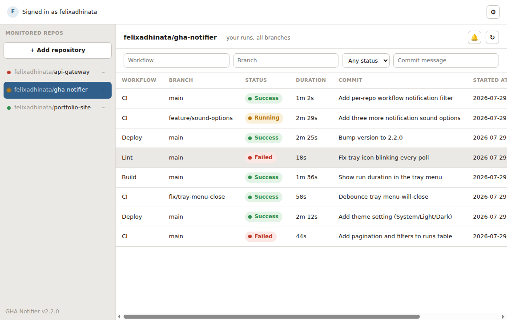

# GHA Notifier

Desktop app for GitHub Actions (Electron + TypeScript). Pick the repositories you want to
monitor; it watches workflow runs you triggered or committed, across every branch, shows
them in a tray icon, and notifies you when they finish.



## Features
- Sign in with the `gh` CLI or a personal access token — no branch picker, no per-branch
  settings; every workflow run you triggered or committed shows up automatically
- Runs table per repo with pagination and filters (workflow, branch, status, commit message)
- Tray icon and menu track a watch list: an entry appears once a run is caught running,
  stays visible with its final status and duration until you clear it, and the icon color
  reflects it (gray/yellow/red/green)
- Per-repo workflow notification filter — pick which workflows you want desktop
  notifications for; leave it empty to get notified for all of them. The same filter also
  narrows the runs table
- Desktop notifications with a "Send test notification" button and a choice of bundled
  sounds (or none), so you can verify things work without waiting for a real run
- System/Light/Dark theme
- Open-on-startup (Linux XDG autostart)

## Requirements
- Node.js 18+ and npm
- Linux runtime libraries (installed automatically as `.deb` dependencies): `libxss1`,
  `xdg-utils`, `libsecret-1-0`
- A `gh` CLI login, or a GitHub personal access token (scopes: `repo`, `workflow`, `read:user`)

## Develop
```bash
npm install
npm start        # builds and launches the app
```

## Lint
```bash
npm run check     # biome check (lint + format check)
npm run format    # biome format --write
```

## Build a `.deb`
```bash
npm install
npm run dist
sudo dpkg -i build/gha-notifier_*_amd64.deb
```

## Releasing
`scripts/publish-release.sh` tags the version in `package.json`, pushes the tag, builds the
`.deb`, and creates (or updates) the matching GitHub release with the `.deb` attached, via
the `gh` CLI:
```bash
bash scripts/publish-release.sh
```

## Project layout
- `app/main/` — main process: config, GitHub API client, poller/notifier, tray, IPC handlers
- `app/preload.ts` — the only bridge the renderer has into Node/Electron (contextIsolation on)
- `app/renderer/` — the UI itself: `index.html`, `style.css`, `renderer.ts`, bundled
  notification sounds under `renderer/sounds/`

## Notes
- Add a repository from the window; there's no branch picker or per-branch settings — every
  workflow run you triggered or committed, on any branch, shows up automatically.
- Tray colors follow priority: yellow (running) > red (failed) > green (succeeded) > gray (no runs yet),
  derived from the tray's watch list rather than full run history.
- Config lives at `~/.config/gha-notifier/config.json` (Electron's per-user app data directory).
